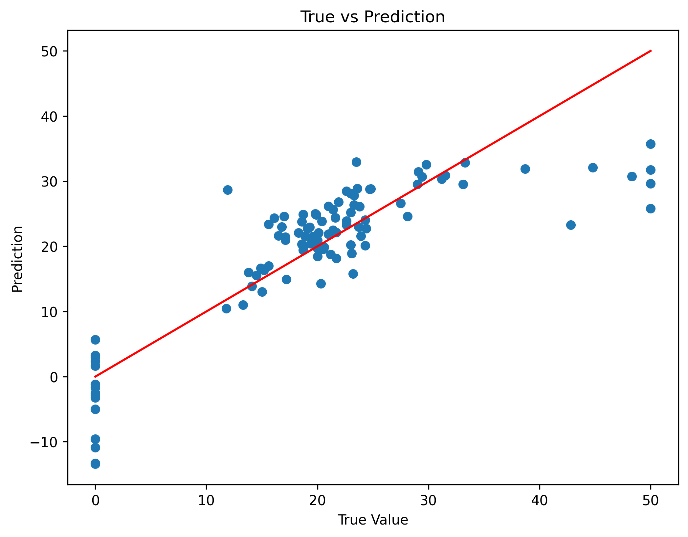

# Boston Housing Price Prediction

## 📌 Overview

This project uses a **Linear Regression model** to predict housing prices based on the Boston Housing dataset.

## 📊 Dataset

* 506 samples
* 13 features (CRIM, RM, LSTAT, etc.)
* Target: MEDV (house price)

## ⚙️ Steps

1. Data loading and preprocessing
2. Handling missing values
3. Train-test split (80/20)
4. Model training (Linear Regression)
5. Prediction and visualization

## 📈 Result

The model captures the general trend, but shows limitations for extreme values.

## 📉 Visualization

## 🛠️ Tools

* Python
* Pandas
* NumPy
* Scikit-learn
* Matplotlib

## 🚀 Future Work

* Feature scaling
* Random Forest / XGBoost
* Hyperparameter tuning
